# **TaskMaster**

## **Lab26**
# Homepage:

*The main page have a heading at the top of the page, an image to mock the `my task` view, and buttons at the bottom of the page to allow going to the `add tasks` and `all tasks` page.*

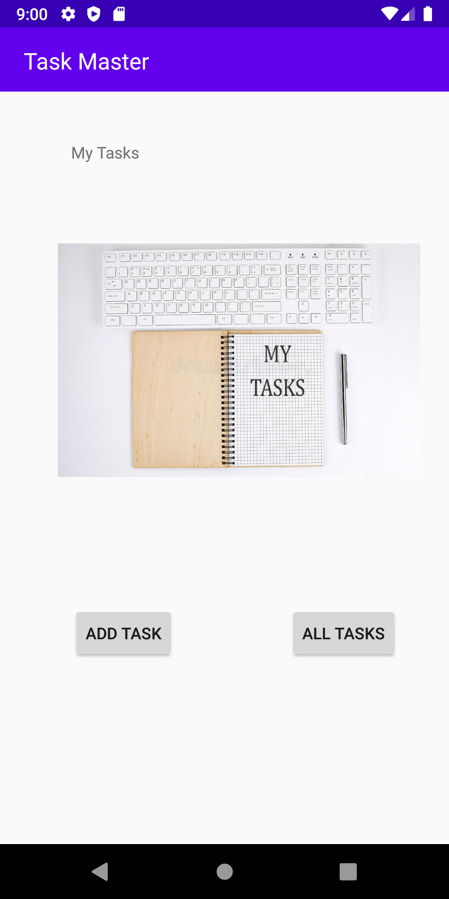

# Add a Task:

*On the `Add a Task` page, allow users to type in details about a new task, specifically a title and a body. When users click the “submit” button, show a `submitted!` label on the page.*

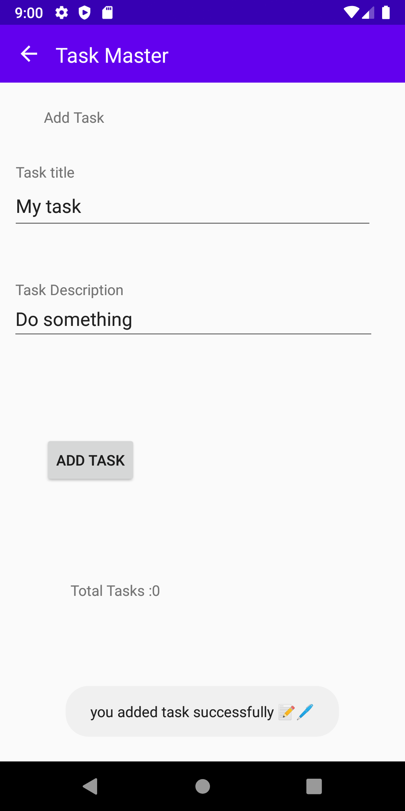

# All Tasks:

*The `all tasks` page should just be an image with a back button*

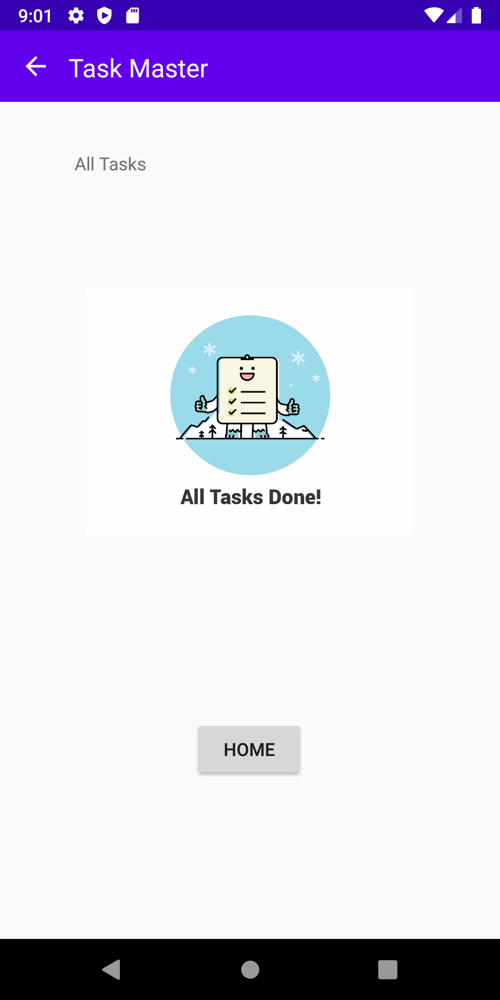

## **Lab27**

# Homepage:

*The main page contain three buttons with hardcoded task titles. When a user taps one of the titles, it should go to the Task Detail page, and the title at the top of the page should match the task title that was tapped on the previous page.*

*The homepage also contain a button to visit the Settings page, and once the user has entered their username, it should display `{username}’s tasks` above the three task buttons.*

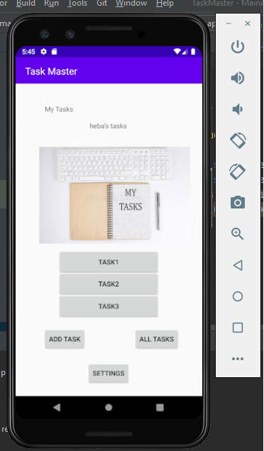

# Settings Page:

*Create a Settings page. It should allow users to enter their username and hit save.*

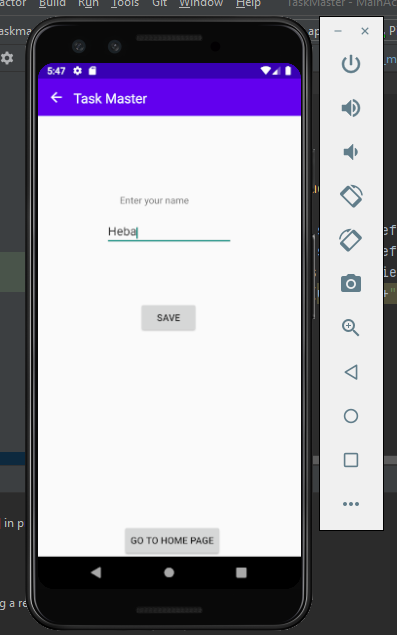

# Task Detail Page:

*Task Detail page have a title at the top of the page, and description.*

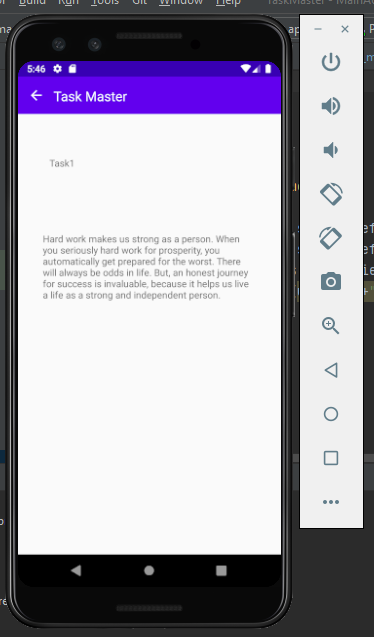

## **Lab28**

# Homepage:

*Refactor the homepage to use a RecyclerView for displaying Task data.*

*you can tap on any one of the Tasks in the RecyclerView, and it will appropriately launch the detail page with the correct Task title displayed.*

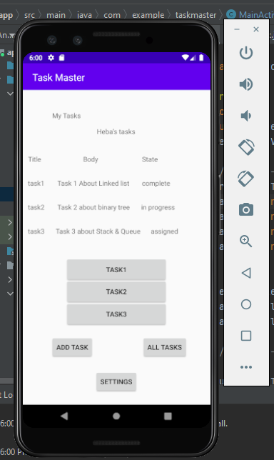

## **Lab29**

# Homepage:

*Refactor your homepage’s RecyclerView to display all Task entities in your database.*

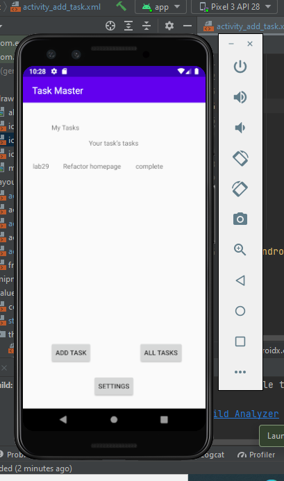

# Add a Task:

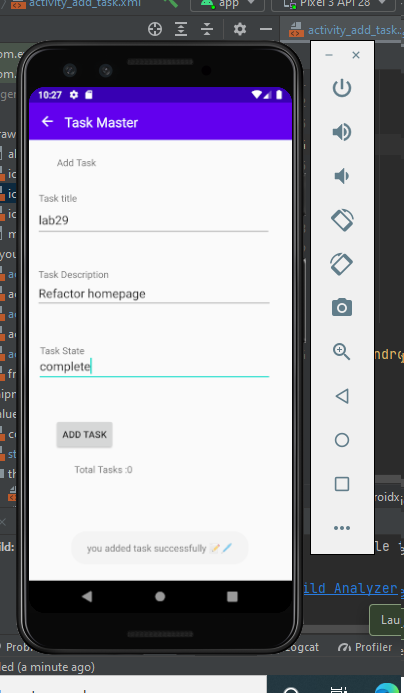

## **Lab31**

# Espresso Testing:

*Add Espresso to application*

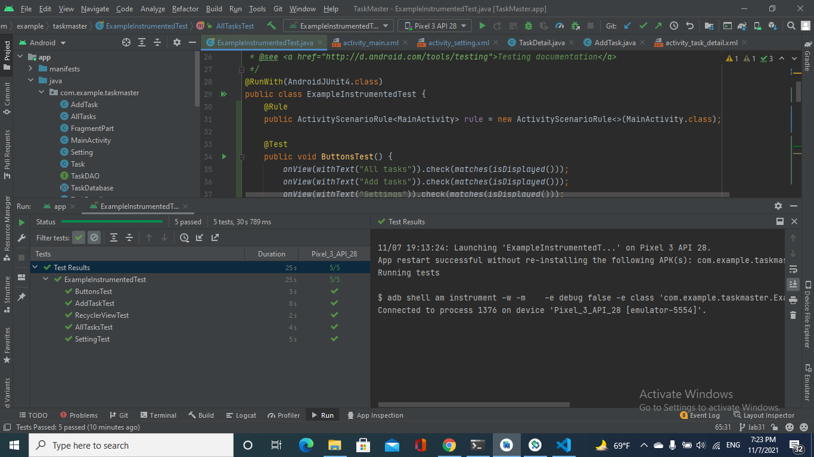

## **Lab32**

* Tasks Are Cloudy
Using the amplify add api command, create a Task resource that replicates our existing Task schema. Update all references to the Task data to instead use AWS Amplify to access your data in DynamoDB instead of in Room.

* Add Task Form
Modify your Add Task form to save the data entered in as a Task to DynamoDB.

* Homepage
Refactor your homepage’s RecyclerView to display all Task entities in DynamoDB.

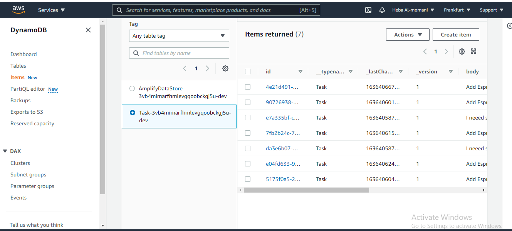

## **Lab33**

* Settings Page

In addition to a username, allow the user to choose their team on the Settings page. Use that Team to display only that team’s tasks on the homepage.

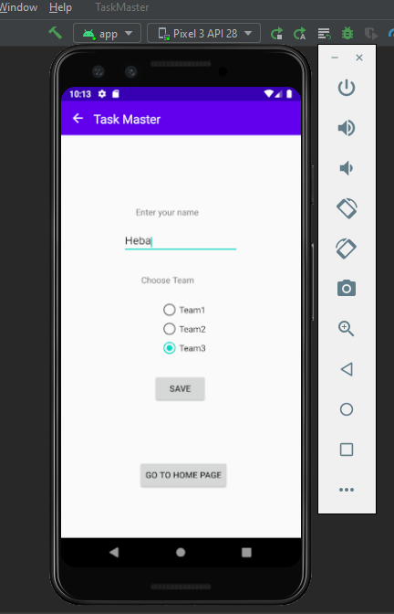

* Homepage

Refactor your homepage’s RecyclerView to display all Task entities in DynamoDB.

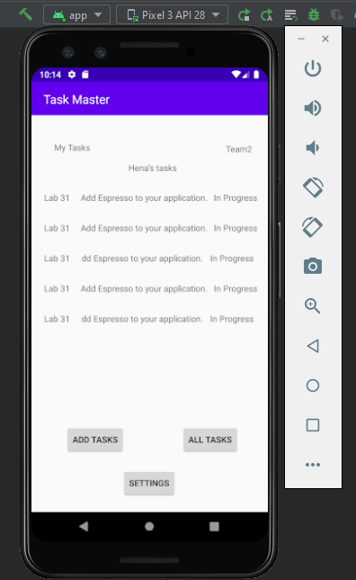

* Add Task Form

Modify your Add Task form to include either a Spinner or Radio Buttons for which team that task belongs to.

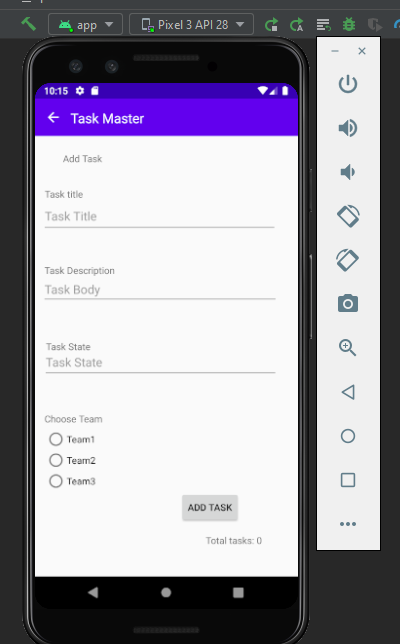

