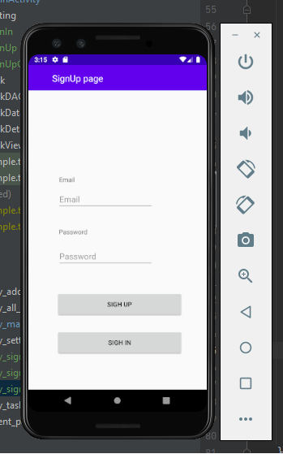
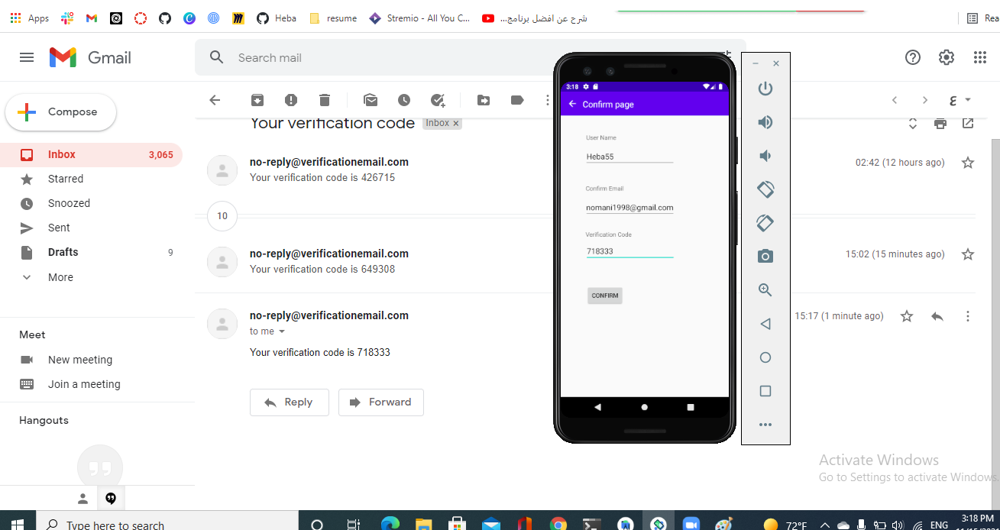
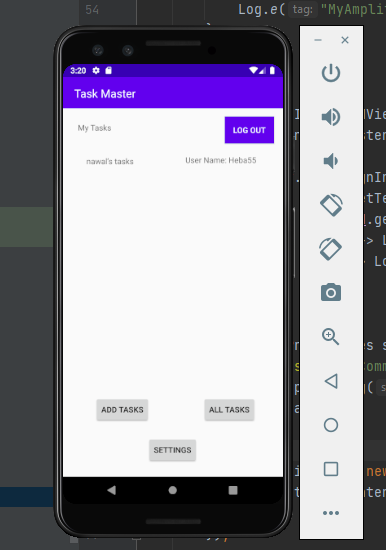
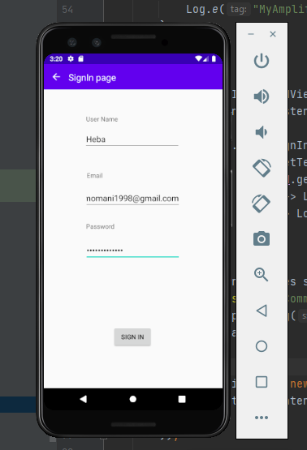
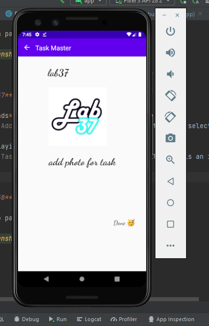
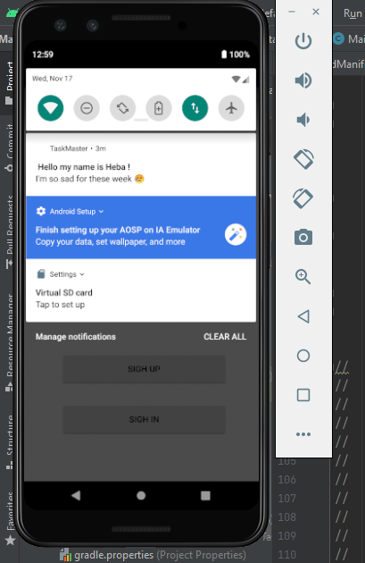
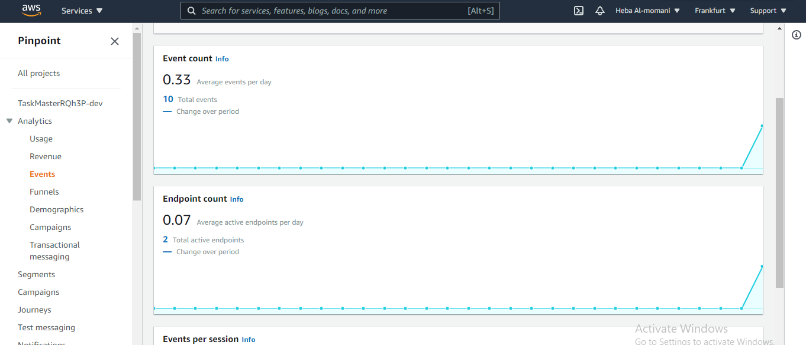
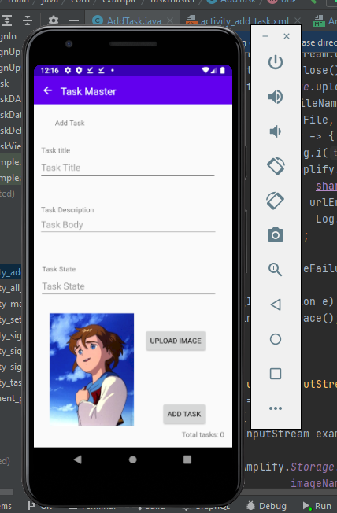
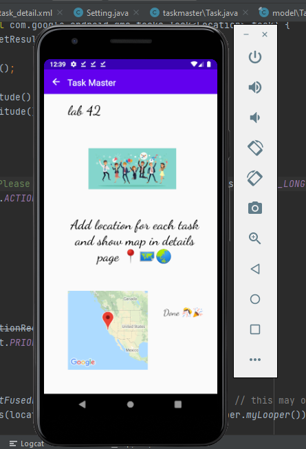

# **TaskMaster**

## **Lab26**
# Homepage:

*The main page have a heading at the top of the page, an image to mock the `my task` view, and buttons at the bottom of the page to allow going to the `add tasks` and `all tasks` page.*

# Add a Task:

*On the `Add a Task` page, allow users to type in details about a new task, specifically a title and a body. When users click the “submit” button, show a `submitted!` label on the page.*

# All Tasks:

*The `all tasks` page should just be an image with a back button*

## **Lab27**

# Homepage:

*The main page contain three buttons with hardcoded task titles. When a user taps one of the titles, it should go to the Task Detail page, and the title at the top of the page should match the task title that was tapped on the previous page.*

*The homepage also contain a button to visit the Settings page, and once the user has entered their username, it should display `{username}’s tasks` above the three task buttons.*

# Settings Page:

*Create a Settings page. It should allow users to enter their username and hit save.*

# Task Detail Page:

*Task Detail page have a title at the top of the page, and description.*

## **Lab28**

# Homepage:

*Refactor the homepage to use a RecyclerView for displaying Task data.*

*you can tap on any one of the Tasks in the RecyclerView, and it will appropriately launch the detail page with the correct Task title displayed.*

## **Lab29**

# Homepage:

*Refactor your homepage’s RecyclerView to display all Task entities in your database.*

# Add a Task:

## **Lab31**

# Espresso Testing:

*Add Espresso to application*

## **Lab32**

* Tasks Are Cloudy
Using the amplify add api command, create a Task resource that replicates our existing Task schema. Update all references to the Task data to instead use AWS Amplify to access your data in DynamoDB instead of in Room.

* Add Task Form
Modify your Add Task form to save the data entered in as a Task to DynamoDB.

* Homepage
Refactor your homepage’s RecyclerView to display all Task entities in DynamoDB.

## **Lab34**

* App APK

## **Lab36**

* Sign up page

* Confirm page

* Main page

* Sign in page

## **Lab37**

* **Uploads**
*On the `Add a Task` activity, allow users to optionally select a file to attach to that task. If a user attaches a file to a task, that file should be uploaded to S3, and associated with that task.*

* **Displaying Files**
*On the `Task detail` activity, if there is a file that is an image associated with a particular Task, that image should be displayed within that activity.*

## **Lab38**

* Sign up page

## **Lab39**

* Tracking Users
  *Add Analytics to your amplify project. Create and send an Event whenever you launch intents that start new activities.*

## **Lab41**

* Adding a Task from Another Application
  
  *Add an intent filter to your application such that a user can hit the “share” button on an image in another application, choose TaskMaster as the app to share that image with, and be taken directly to the Add a Task activity with that image pre-selected.*
  

## **Lab42**

* Location
  *When the user adds a task, their location should be retrieved and included as part of the saved Task.*

* Displaying Location
  *On the Task Detail activity, the location of a Task should be displayed if it exists.*

